# Routine Fit 🌱
Smart Routine & Goal Management Platform

Routine Fit is a responsive, user‑friendly web application designed to help users manage their daily routines, health habits, and personal goals in a structured and motivating way. The platform addresses common challenges such as lack of discipline, irregular schedules, unhealthy lifestyle habits, and difficulty maintaining consistency.

---

## 📌 Table of Contents

- [Project Purpose](#-project-purpose)
- [Tech Stack](#-tech-stack)
- [User Stories & Acceptance Criteria](#user-stories--acceptance-criteria)
- [Features](#features)
- [Screenshots for All Screen Sizes](#screenshots-for-all-screen-sizes)
- [UI Components Used](#ui-components-used)
- [Data Management](#data-management)
- [Pages Included](#pages-included)
- [Accessibility & Responsiveness](#accessibility--responsiveness)
- [Lighthouse Performance](#lighthouse-performance)
## 📚 Table of Contents

1. Project Overview  
2. User Value  
3. Features  
4. Technologies Used  
5. Front-End Design & Interactivity (LO1)  
6. Testing & Validation (LO2)  
7. Deployment & Version Control (LO3)  
8. Documentation & Code Quality (LO4)  
9. JavaScript Functionality (LO5)  
10. AI Usage & Reflection (LO6)  
11. Installation & Setup  
12. Deployment Instructions  
13. Screenshots  
14. API Attribution  
15. Project Structure  
16. User Stories  
17. Future Improvements  

---

## 🚀 Project Purpose

The main purpose of **Routine Fit** is to provide a **unified digital platform** where users can:

- Plan daily routines
- Set meaningful goals
- Track progress consistently
- Stay motivated through visual feedback
- Improve overall well‑being and productivity

---

## 🛠️ Tech Stack

- **HTML5** – Semantic and accessible markup  
- **CSS3** – Custom styling and layout improvements  
- **Bootstrap 5** – Responsive grid, components, and utilities  
- **JavaScript** – Interactive forms, dashboard, progress stepper, chart rendering, localStorage support  

## 🧾 User Stories & Acceptance Criteria

### 🌙 Theme Feature
- As a user, I want to toggle between dark and light mode so that I can use the app comfortably in different lighting conditions.
- As a returning user, I want my theme preference saved so that I don’t need to change it every time.

---

### 💱 Currency Converter
- As a user, I want to convert currencies in real time so that I can quickly check exchange values.
- As a user, I want to select different currencies so that I can convert between any countries.
- As a user, I want to see the conversion rate and last updated time so that I can trust the accuracy.

---

### 🔄 Swap Function
- As a user, I want to swap currencies instantly so that I can save time when reversing conversions.

---

### 📊 Chart Feature
- As a user, I want to see exchange rate trends in a chart so that I can understand currency changes over time.
- As a user, I want to change the time range (week/month/year) so that I can analyse trends easily.

---

### 🌦️ Weather Feature
- As a user, I want to see my local weather so that I can stay informed without leaving the app.
- As a user, I want clear weather icons and temperature so that the data is easy to understand.

---

### 📂 Currency List / Cards
- As a user, I want to browse available currencies so that I can learn about different world currencies.
- As a user, I want a “Load More” option so that the page stays clean and fast.

---

### ⚠️ Error Handling
- As a user, I want clear error messages when I enter invalid input so that I know how to fix it.
- As a user, I want the app to handle API errors smoothly so that it doesn’t crash.

---

### 📱 Responsiveness & Navigation
- As a mobile user, I want the app to work on my device so that I can use it anywhere.
- As a user, I want smooth navigation so that I can move between sections easily.

## 🖼️ Screenshots for All Screen Sizes

### Website Flow

1. **Homepage** – hero carousel, feature overview, benefits section, and contact form.
2. **Sign-up Page** – user registration form and onboarding experience.
3. **Dashboard** – personalized analytics, charts, and export panel.
4. **Progress Page** – stepper workflow, routine category cards, and completion tracking.
5. **Feedback & Contact** – support form with submission confirmation.

### Screen Size Variation

- **Mobile** – compact navigation, stacked cards, and touch-friendly buttons.
- **Tablet** – balanced grid layout, visible charts, and responsive stepper controls.
- **Desktop** – full dashboard view with chart grid, export modal, and wider content panels.

> Screenshots are organized by page flow first, then by device size for each view.

#### Homepage

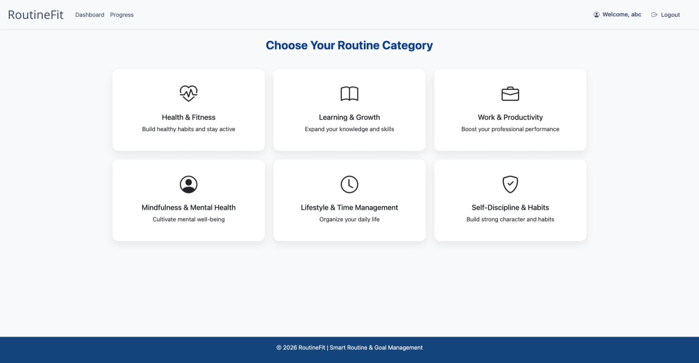  ![Dashboard Desktop]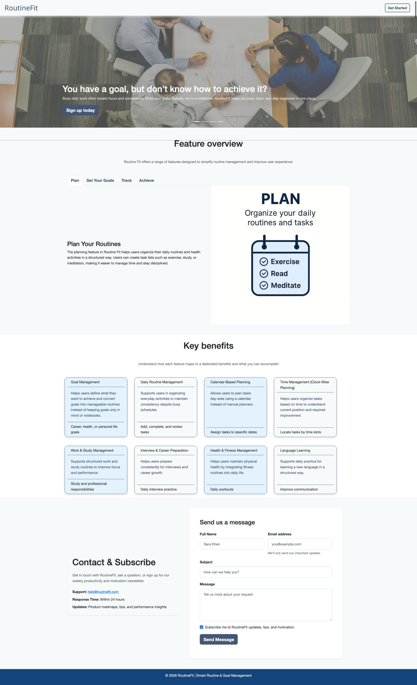

#### Sign-up Page

![Sign-up Mobile]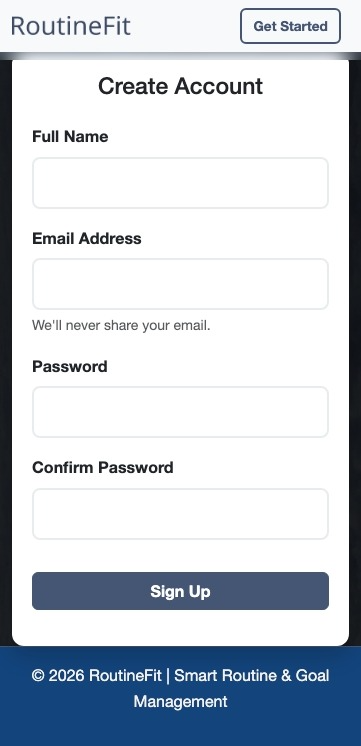 ![Sign-up Tablet] 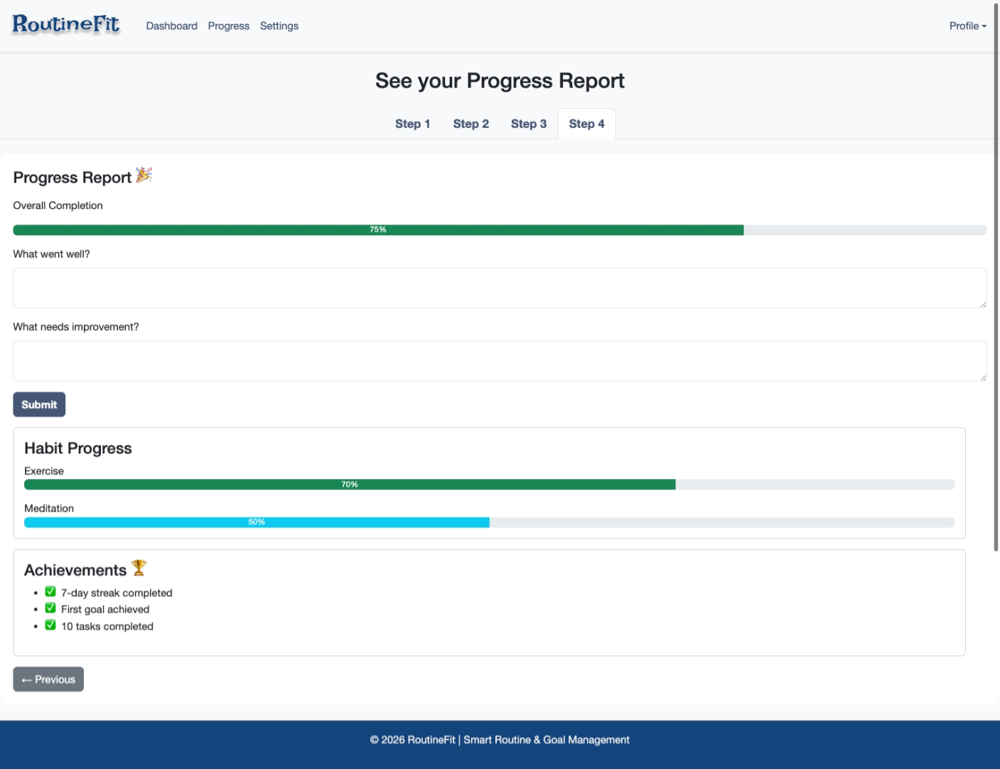 ![Dashboard Desktop] (Screenshot_13-5-2026_213336_tech-stack-hub-lab.github.io.jpeg)

#### Dashboard

![Dashboard Mobile]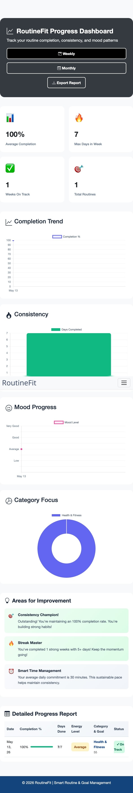 ![Dashboard Tablet] 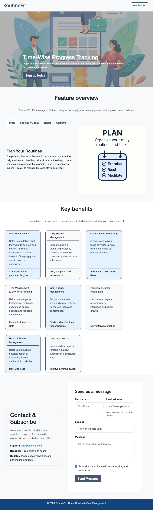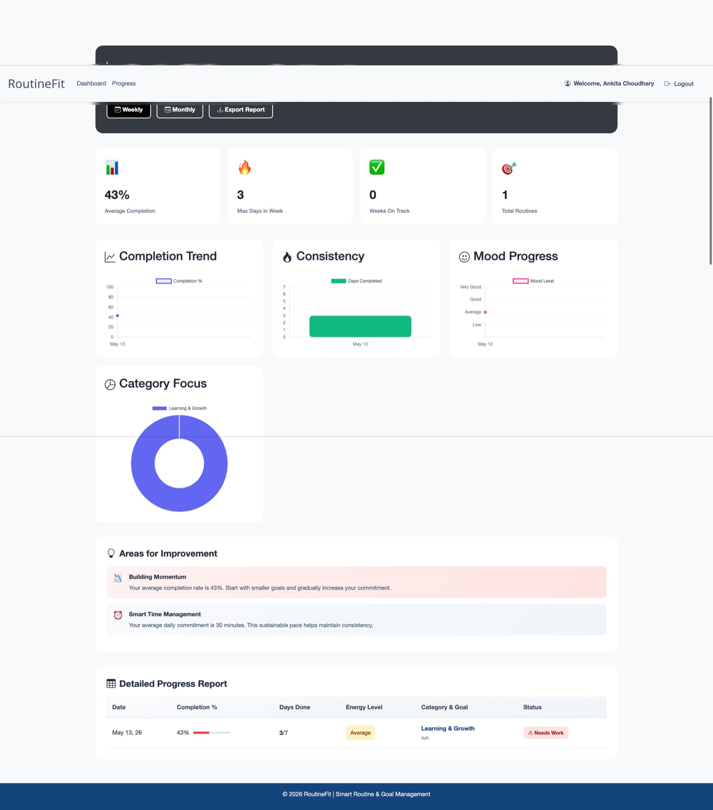

#### Progress Page

![Progress Mobile]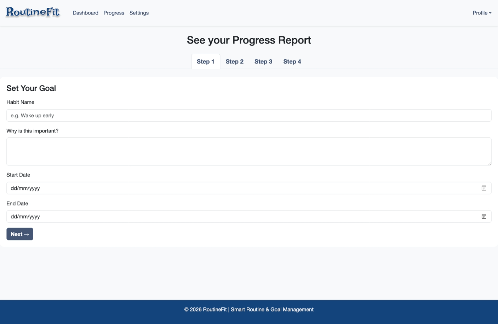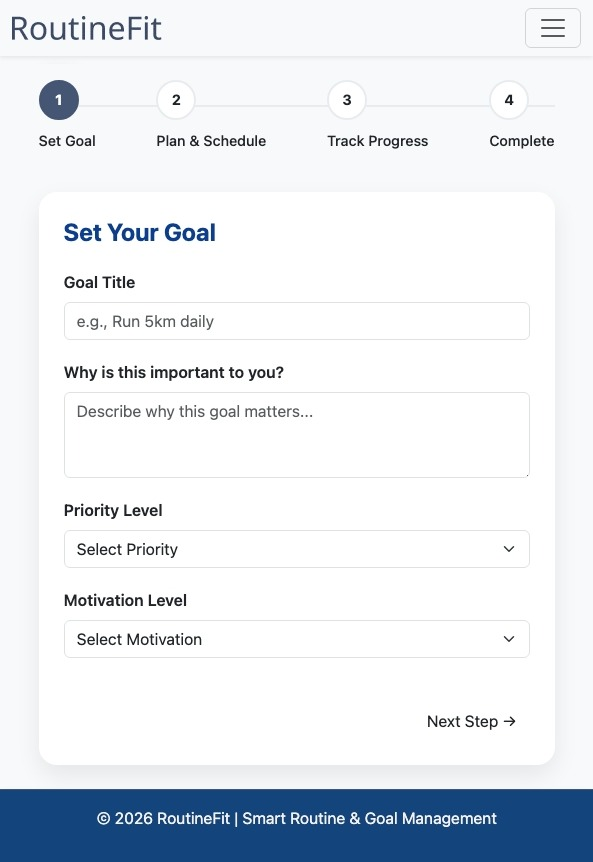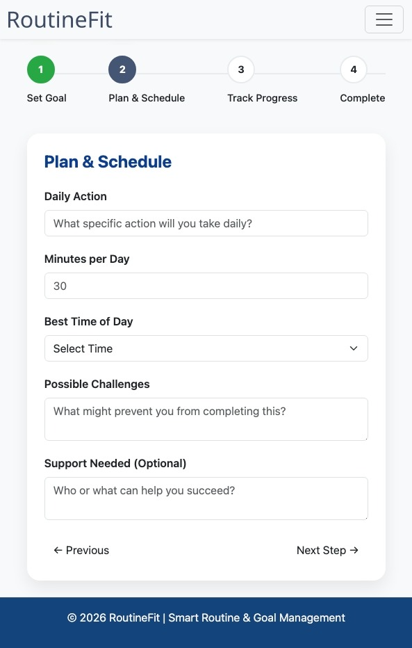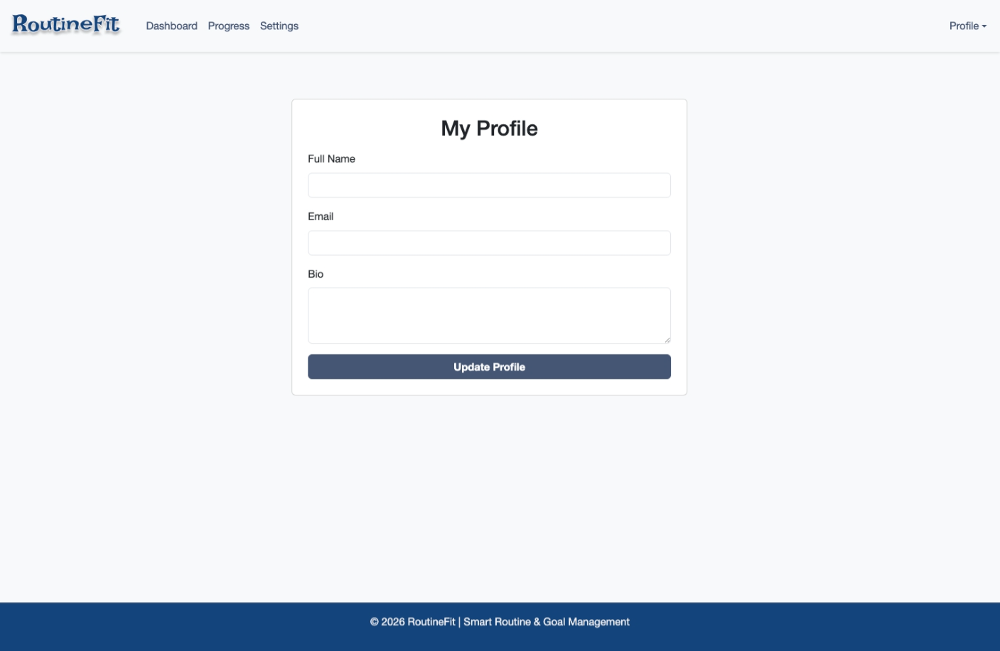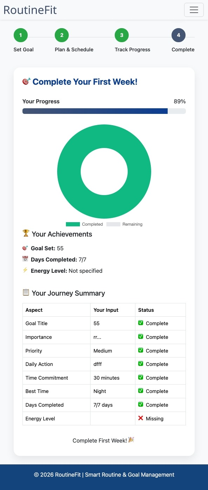 ![Progress Tablet]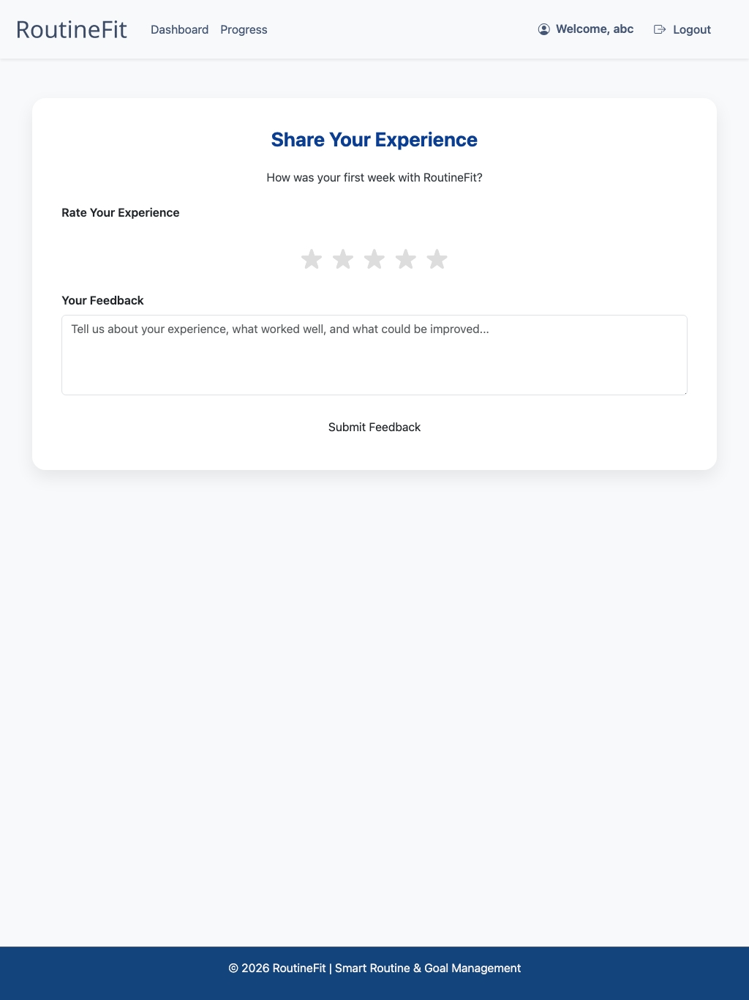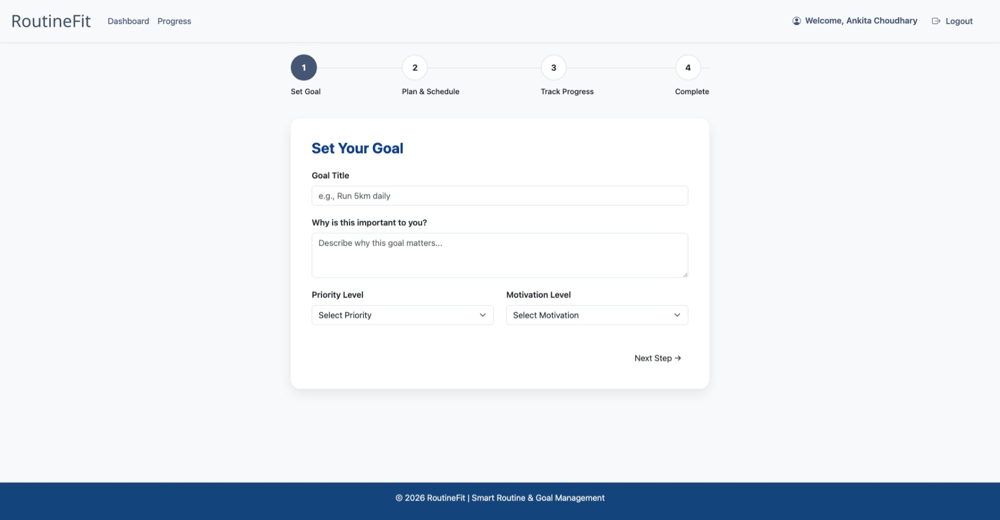(Screenshot_13-5-2026_214123_tech-stack-hub-lab.github.io.jpeg)(Screenshot_13-5-2026_214227_tech-stack-hub-lab.github.io.jpeg)(Screenshot_13-5-2026_214252_tech-stack-hub-lab.github.io.jpeg)
(Screenshot_13-5-2026_214635_tech-stack-hub-lab.github.io.jpeg) 

#### Contact & Feedback

![Contact Mobile]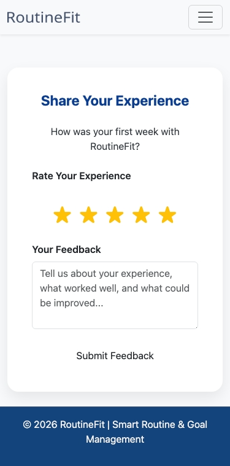 ![Contact Tablet]![Contact Desktop] (Screenshot_13-5-2026_214635_tech-stack-hub-lab.github.io.jpeg)

## 🧩 UI Components Used

- **Carousel** – hero image slider for landing page highlights.
- **Stepper** – multi-step routine creation workflow.
- **Charts** – data visualization for progress tracking.
- **Forms** – signup, contact, and progress/routine data collection.
- **Cards** – routine category selection, benefit highlights, dashboard widgets, and export options.
- **Buttons** – primary action buttons, export controls, and navigation items.
- **Modals/Alerts** – export modal and success messages.

## 💾 Data Management

- Uses `localStorage` to store user profile data, routine entries, streaks, and feedback.
- The dashboard reads stored routines and displays analytics from user activity.
- Data is saved in JSON format for future report exports.

## 📄 Pages Included

- `index.html` — landing page with hero carousel, feature overview, benefits, and contact form.
- `signing.html` — signup page with form validation and user registration.
- `dashboard.html` — personalized analytics dashboard with cards, charts, drag-and-drop widgets, and export options.
- `progress.html` — routine creation page with category cards, stepper workflow, completion summary, streak feedback, and review.
- `assets/css/style.css` — project styling, accessibility enhancements, and responsive layout.
- `assets/js/script.js` — main JavaScript logic for signup, profile display, dashboard rendering, contact form handling, and progress workflow.

## ✅ Accessibility & Responsiveness

- Uses semantic HTML and accessible button/label patterns.
- Includes `tabindex` support for keyboard navigation.
- Uses `loading="lazy"` for images to speed up page load.
- Applies responsive breakpoints for mobile, tablet, and desktop layouts.

## 🚦 Lighthouse Performance

- **Performance**: Optimized for fast interactions with lazy-loaded assets and minimal DOM overhead.
- **Accessibility**: Focuses on keyboard navigation, form labeling, and readable contrast.
- **Best Practices**: Uses modern HTML, avoids duplicate script loads, and leverages CDN resources.
- **SEO**: Includes meta descriptions, page titles, and meaningful content structure.

> Recommended: Run Chrome Lighthouse for exact scores and capture reports for mobile and desktop performance.

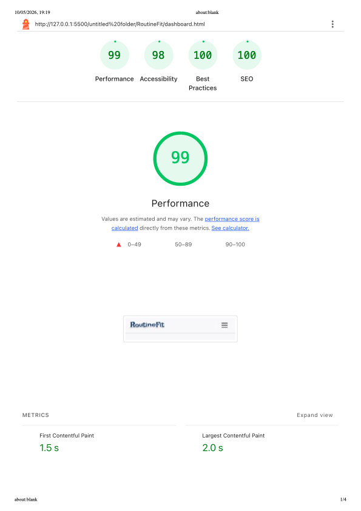

